### Du hack et des sprints en sociologie(s) ? Des tensions aux inter-médiations en contexte numérique

Colloque "Retours critiques sur les sociologies numériques"

6-7 Septembre 2017

+++

Session : Enquêtes et terrains numériques II : des ethnographies aux hackathons

  - Constance de Quatrebarbes (BnF, JailBreak)
  - Célya Gruson-Daniel (Costech/LabCMO)

---

### Eléments de contexte

Apparition de nouveaux "formats-courts"  en SHS associés aux recherches numériques

**Hackathon, Data Sprint et Camp** quelques exemples pour commencer...

---
#### Data sprint :

**Digital Methods Initiative** (Janvier 2013)

1er Data Sprint « Data Sprint : The New Logistics of Short-form Method »

*[Digital Methods Initiative Winter School2013](https://wiki.digitalmethods.net/Dmi/WinterSchool2013)*

---?image=img/DMI_2013.png&size=80

#### Data sprint :

**EMAPS (Electronic Maps to Assist Public Science) Data sprint** (Janvier 2014)

Rencontres interdisciplinaires / Projet Science-société (Venturini, Munk et Meunier, 2016)

*[Blog Emaps Project](http://www.emapsproject.com/blog/archives/2244)*

---?image=img/emaps_sprint.png&size=80

#### Hackathon :

**Center for Humanities (Wisconsin University)** (2012)

« Humanities Hackathon : Computational Approaches to Cultural Analysis and Visualization ».  

Familiarisation avec nouvelle méthode *(machine learning, network theory, topic modeling, advanced visualization and sound processing)*

*[Wisc Univerity ](https://wiscmusiccareer.wordpress.com/2012/06/21/humanities-hackathon-computational-approaches-to-cultural-analysis-and-visualization/)*

---?image=img/wisc_hackathon.png&size=auto

#### Hackathon :

**Hackathon Recherche République Numérique** (Décembre 2015)

*[HackRepNum ](https://storify.com/HackYourPhd/hackrepnum)*

---?image=img/hyphd_prez_repnum.png&size=auto

#### THATCamp

- 2008 : 1er THATCamp inspiré des Barcamp
- 2010 : THATCamp en France : manifeste des Humanités Numériques

*[THATCamp_France ](http://tcp.hypotheses.org/category/thatcamp-paris-2010)*
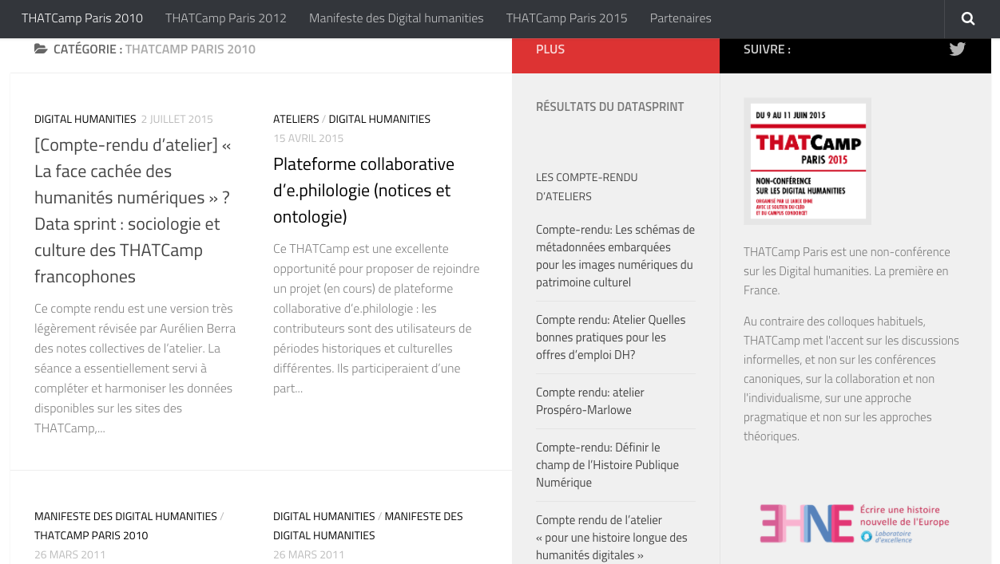

---?image=img/Thatcamp_France.png&size=60

#### Formats courts : caractéristiques communes

- **Durée** : quelques jours (1 jour à 1 semaine)
- **Mode projet** avec *challenge* (marathon, sprint)
- **Travail en équipe** et profils variés
- **Organisation libre**
- Articulation **présentielle et en ligne**
- **Philosophie "hack", "make"** (bidouille, créativité, et faire ensemble)

---

#### En sociologie : une mise en tension du "métier de sociologue"

Le métier de sociologue

- **Temps long** de la recherche et de la  construction des objets d'étude
- **Nécessité de distanciation** des acteurs du terrain et de la figure de l'expert (garantie de liberté et d'autonomie)

**

(Bourdieu Pierre, Chamboredon Jean-Claude et Passeron Jean-Claude, 1983)

+++

#### Formats courts : une utopie technicienne ?

- Production limitée dans un temps court
- Qualité des connaissances produites
- Réorganisation au sein de la sociologie ?

---

#### Formats courts : des tensions aux inter-médiations ?

  - Que provoquent ces formats courts en sociologie ?
  - Quelles tensions révèlent-ils dans ce contexte numérique ?  
  - Quelles adaptations au numérique peuvent-ils permettre d'accompagner en sociologie ?

==> *Comment ces formats courts questionnent-ils et participent-ils aux évolutions de la pratique sociologique en contexte numérique ?*

---

#### Appuis théoriques : Numérique & Recompositions

---

#### Sociologie du Web/Numérique  :

- Effet pervasif du numérique : "amplificateur et accélérateur de tendances" (Boullier 2016)
- Effet de levier pour réorganisations sociales, économiques, politiques, etc. (Proulx, 2005)
- Utopies/Dystopies et imaginaires numériques (Loveluck, 2015 ; Turner 2012)

---

#### Anthropologie des connaissances

Numérique & SHS

  - Data & SHS : datafication, collectivisation (Jaton et Vinck, 2016)
  - Recherches numériques (Plantin, Monnoyer-Smith, 2013)

==> transformation des pratiques, des objets de recherche mais aussi des collectifs de recherche

---

#### Comprendre les processus à l'oeuvre

Intégration/ Institutionalisation des pratiques/conceptions issu de l'informatique au sein d'autres disciplines

    - Open et entreprise (FLOSS) ; Open et Administration (Open Data)(REF)
    - FabLabs : principe de *soft hacking* (processus d'institutionalisation)(REF)

---
#### Comprendre les processus à l'oeuvre

Adoption/adaptation et processus d'inter-médiations (REF)

  - intermédiations : rencontres entre plusieurs mondes
  - médiations : exploration commune (traduction et compréhension mutuelle )
  - rôle d'agents mais aussi des espaces et des dispositifs

Les formats courts dispositifs de soft hacking ?

---

#### Methodologie et temps de l'article

---

#### Brève généalogie des formats courts

Recherche documentaire et enquête auprès d'acteurs du milieu (début en France)

==>  mise en avant des modes de pensées et d'organisation à l'origine de ces formats

+++

#### Exploration de trois mises en tension en sociologie

**Approche ethnographique**  : obervation participante/participation observante

- rapport aux temps de la recherche
- rapport à la production des savoirs
- rapport à la technique et au collectif de recherche

==> Cas d'étude principal : Hackathon République Numérique #HackRepNum

---

### Brève généalogie des formats court

---

#### Les "Ancêtres"

**Association for Computing Machinery** (1974)

*[International Collegiate Programming Contest ]()*

---?image=img/ACM-ICPC-1978.png&size=60

**Scene Demo and LAN Party (Local Area Network)**

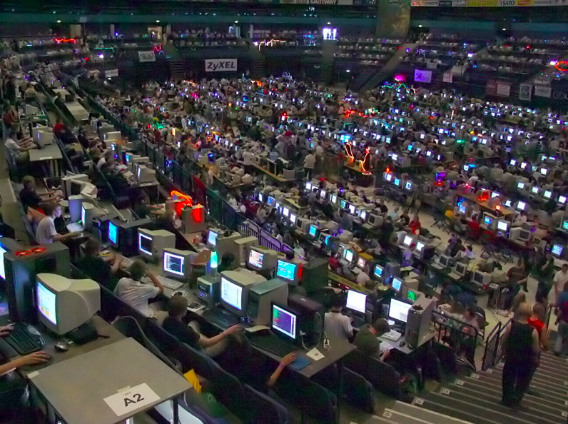

---

#### 1999 : Premiers Hackathons

- **Open BSD** (Calgary)

Ambiance Hackathon "sit down and code"

*[Open BSD ](ARAJOUTER)*
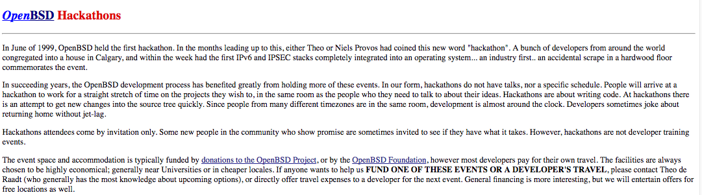

+++
*[Open BSD ](ARAJOUTER)*
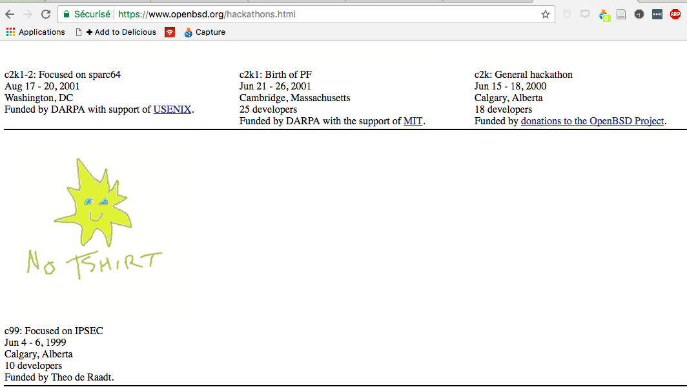

+++

"Shut up and hack" "taking action in the source tree"

*[Open BSD ](ARAJOUTER)*
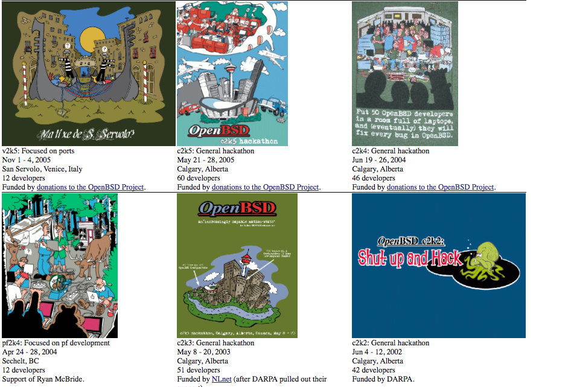

---

#### 1999 : Premiers Hackathons

- **Sun Microsystem** (San Francisco)

Conférence Java One

*[Wayback Machine Sun Microsystem](ARAJOUTER)*
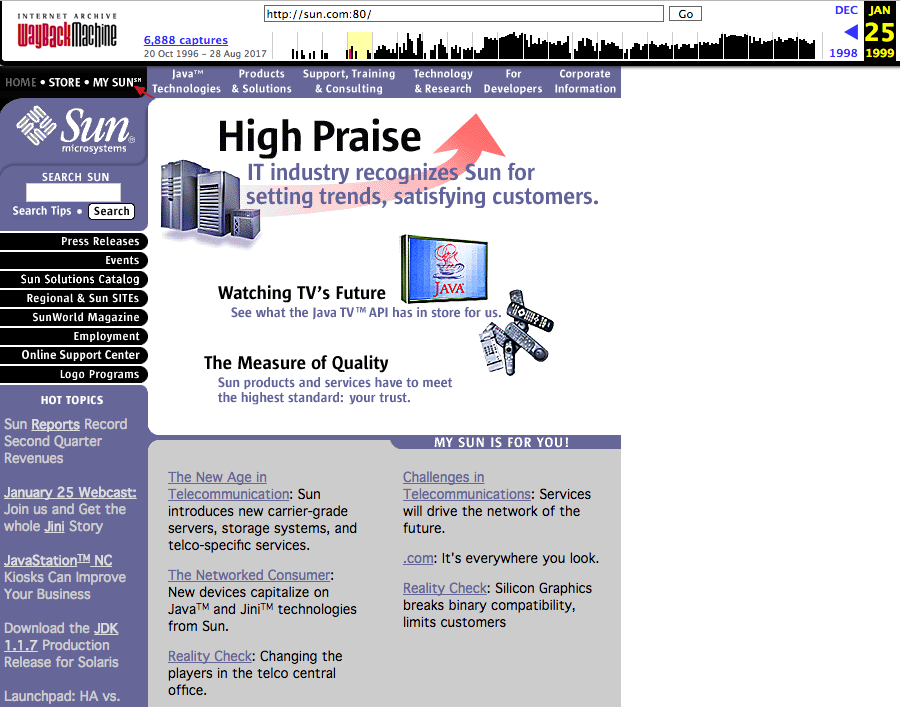

---

#### 2000-... : Généralisation dans les milieux informatiques - Sprint et méthodologies agiles (

Gestion de projets en programmation : SCRUM et XP Extreme Programming

*[Agile manifesto](ARAJOUTER)*
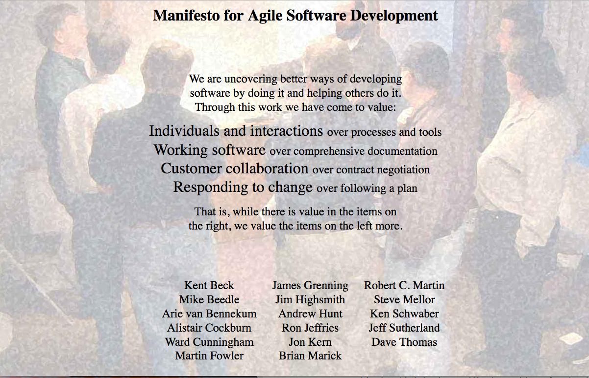

+++

- cycle court et mini-objectifs
- valeurs : logiciels operationnels, interaction avant résultats, collaboration, flexibilité

==> Hackathon, sprint : nouvelle méthode et libération pratiques industrielles (agile vs cycle V)

---

#### Aujourd'hui : Hackathon, sprint, camp - nouvelles formules magiques de l’innovation numérique ?

- Distanciation de l'objet technologique
- Evènements thématiques (Briscoe et Mulligan,
2014)
- Diversification des formats : Milieu Start-up
  - 2006 : 1er BarCamps
  - Autres noms tombés en désuétude :  Yullbiz

---

#### En France :

- **#HackThePress** (2010)

*[Owni.fr](http://owni.fr/2010/09/27/battle-hackthepress-design-technologie-journalisme/index.html)*
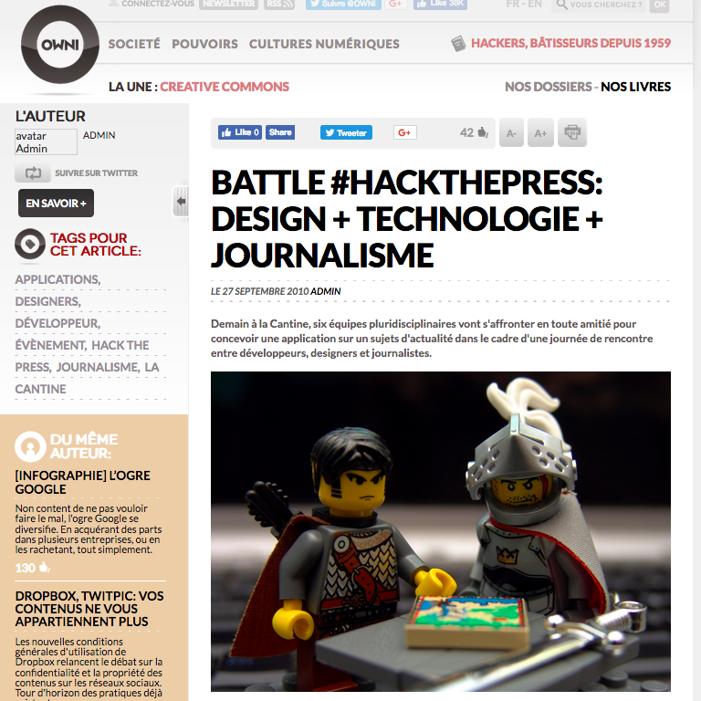

---

2016 : #HackingParis2024

*[Owni.fr](https://www.hackinghoteldeville.paris/fr/)*
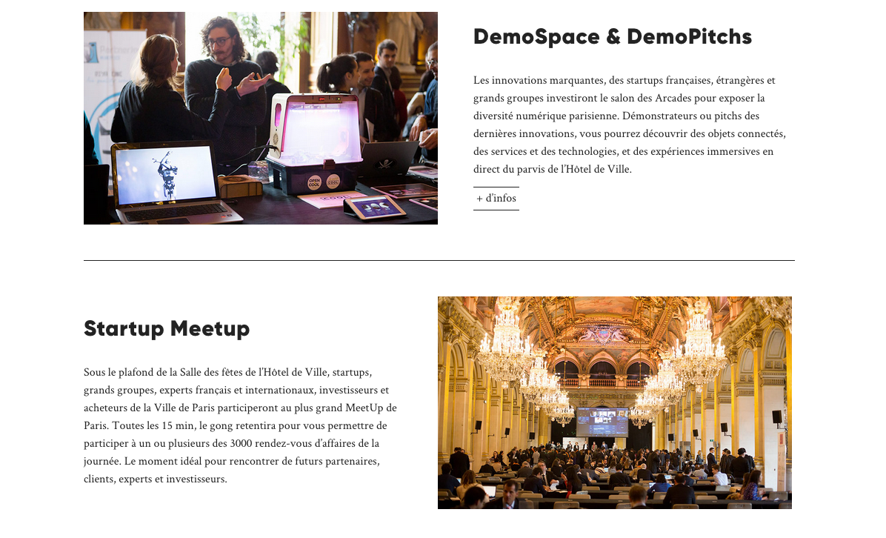

---
#### Notre préféré !

*[Owni.fr](https://motherboard.vice.com/fr/article/a3zn74/au-coeur-de-linnovation-stupide-avec-les-participants-du-premier-hackacon-de-paris)*
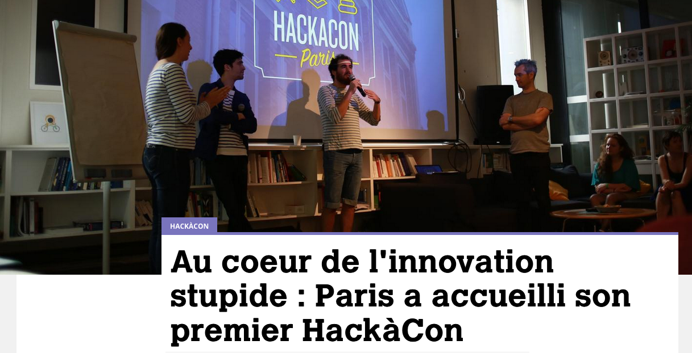

Quelques exemples de projets proposés : Plâtrer la fracture numérique, la startup à l'heure du fax.

---
#### En Recherche :

- HackingEbola, Brainhack, etc.

*[Brainhack.org](http://www.brainhack.org/)*
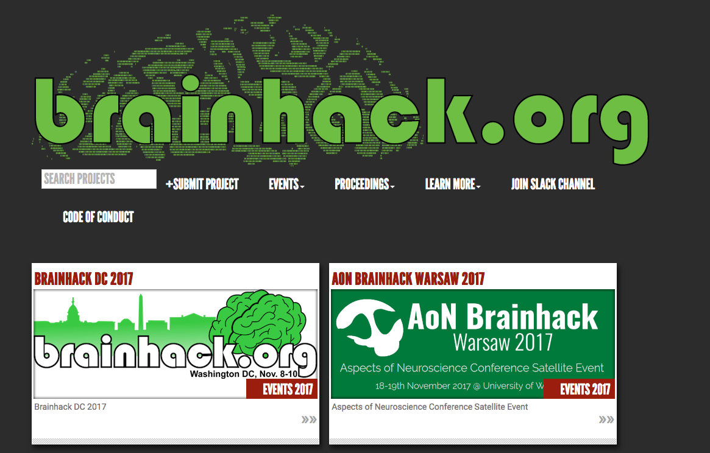

+++

- **#HackRepNum** (Décembre 2015)

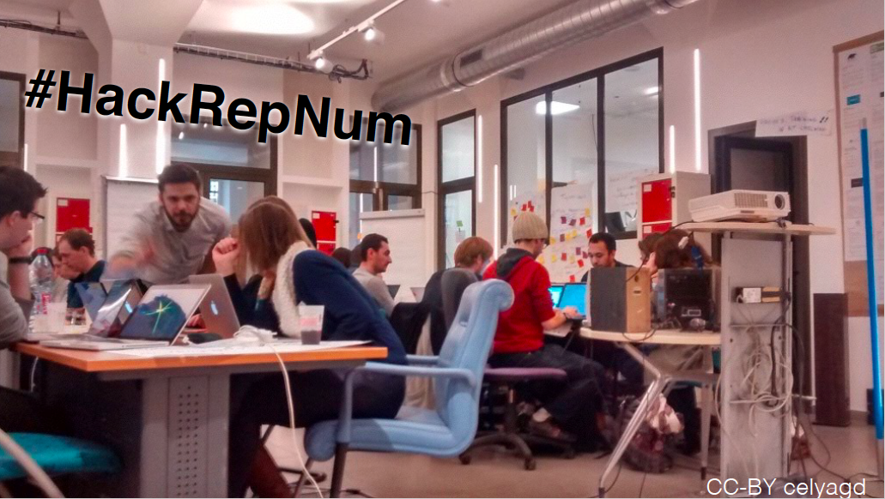

---
### Exploration de trois mises en tension en sociologie

- #HackRepNum
- Tensions
- Inter-médiations

---

### 1-Rapport au temps :

- **#HackRepNum :** une journée d'évènement (présentation, constitution des équipes, travail en groupe, présentations des résultats en fin de journée)

- **Tensions :** méthode accélérée versus *slow science*

---
### 1- Rapport au temps : de l’effet sprint à la course de fond

- **Une préparation longue en amont** : invisibilisation des étapes de fabrication/préparation de données : *datafication*

- Négociation pour mettre en ligne les données de la consultation Etalab

==> réseau socio-technique à l'oeuvre pour l'organisation et la mise en oeuvre d'un tel évènement : rencontre entre plusieurs mondes

---

### 2- Rapport aux savoirs et à leurs productions :

- **#HackRepNum :** Rencontre de profils variés (chercheurs, juristes, membres d'association, gouvernement, designer, journalistes, etc.)

- **Tensions :** rôle d'expertise, indépendance du chercheur, qualité des connaisances produites et diffusées en ligne

---

### 2- Rapport aux savoirs et à leurs productions : : d’autres sociologies sont possibles

- **Dans la lignée des postures participatives** : Science en société (Bonneuil, Joly, 20), production de savoirs orientés vers l'action (Pestre, 2003)

==> aide à des projets de recherche, d'une relation science et société à une science en société  (autre exemple EMAPS)

---

### 3-Rapport à la technique :

- **#HackRepNum :** attentes des participant.e.s : découverte de l'*open science*, apprentissage du code, maitrise des *data*

- **Tensions :** nouveau positivisme et quantophrénie

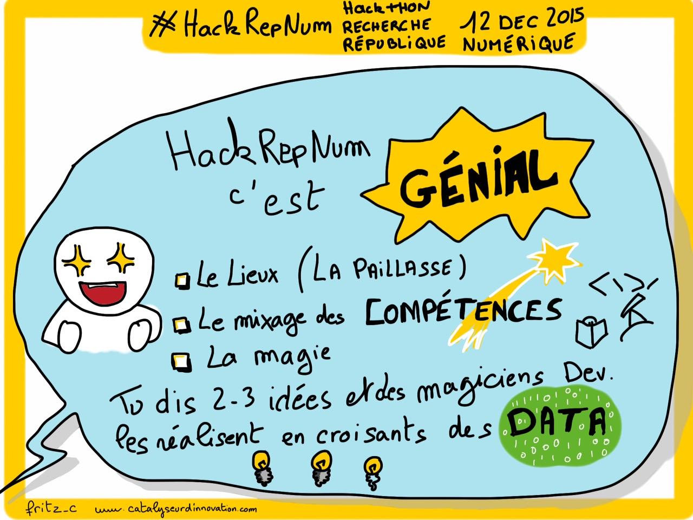

- **Tensions :** Collectivisation (Jaton & Vinck) : travail collectif en SHS

==> transformation rapport profils techniques et sociologues, rapport hiérarchique et autorité

---

### 3-Rapport à la technique : collectif de recherche recomposé autour des data

- Un moyen d'éprouver les data :  médiations par le faire,  prise de conscience de l'effet whaouu des donnés

==> Formations aux méthodes numériques, lieu d'exploration, d'apprentissage et d'habilitation aux données exploration des méthodes numériques par le "faire"

---
### Retour sur le numéro sociologies numériques critiques

Sociologie & Sociétés ==> Sociologie*S* et sociétéS

- Evolution des postures de recherche

- Numérique : modèle et est modelé par la sociologie

---

### Conclusion : ouverture critique du sociologue

- Apport du regard critique du sociologue "ouverture critique" (Proulx 1984)

*[Proulx S., 1984, « Présentation : L’informatisation : mutation technique, changement de société? », Sociologie et sociétés, 16, 1, p. 3‑12.  ](http://yogeekons.tumblr.com/search/informatisation)*
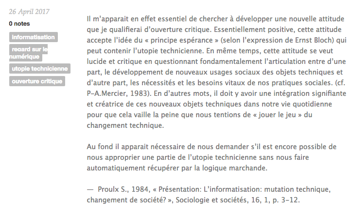

---

### Perspectives et questionnements

- Notion de dispositif ?
- Méthodologie (attente de critiques)
- Propre posture de recherche et implication  

### Les mots de la fin...

*[Trumpocalypse  ](http://rossgoodwin.com/trumpocalypse/)*
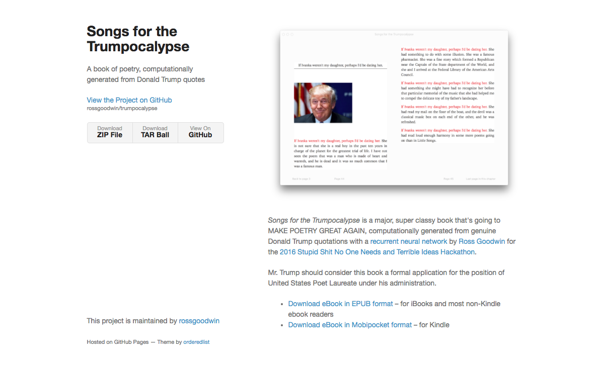

---
*[Hypochondriapp ](http://hypochondriapp.io/)*

