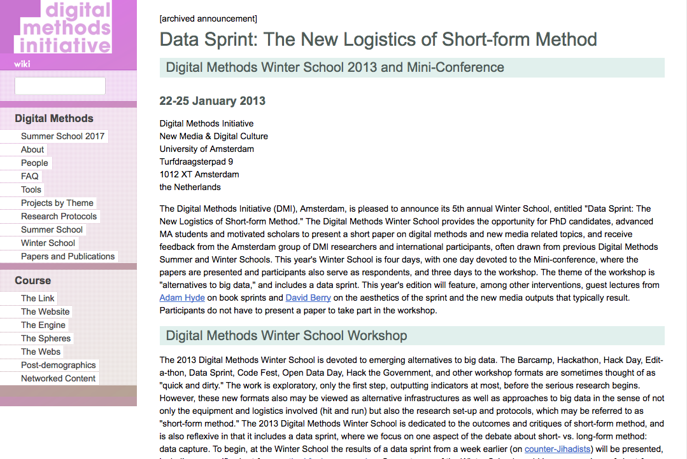
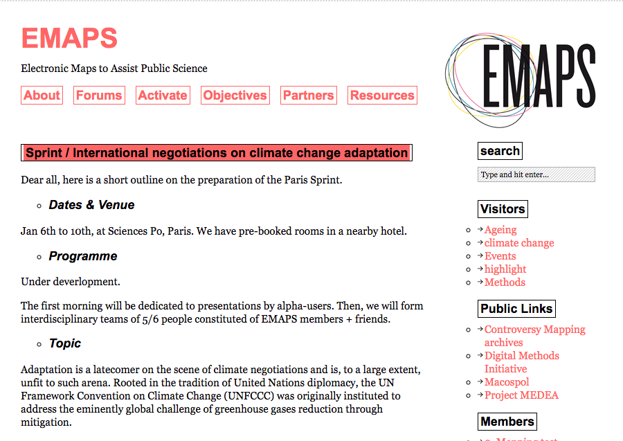
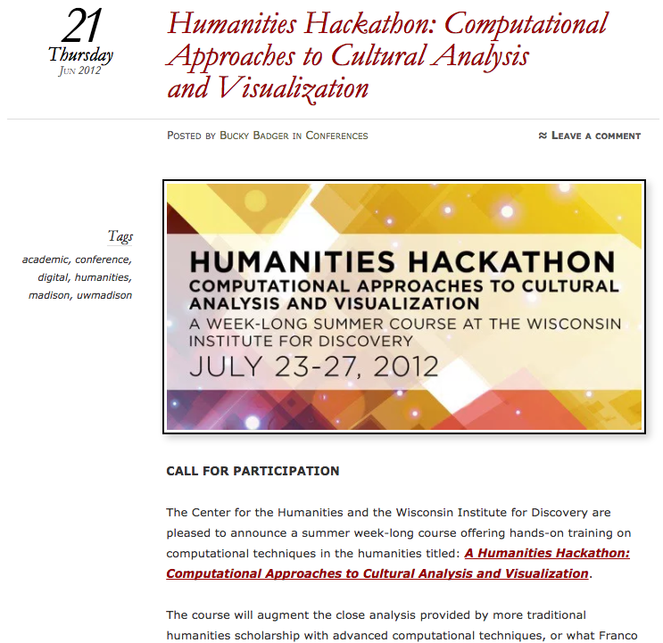
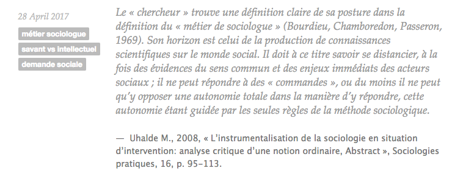

### Du hack et des sprints en sociologie(s) ? Des tensions aux inter-médiations en contexte numérique

Colloque - Retours critiques sur les sociologies numériques

6-7 Septembre 2017

+++

Session - enquêtes et terrains numériques II : des ethnographies aux hackathons

  - Constance de Quatrebarbes (BnF, JailBreak)
  - Célya Gruson-Daniel (Costech/LabCMO)

---

### Eléments de contexte

Apparition de nouveaux "formats-courts"  en SHS associés aux recherches numériques

**Hackathon, Data Sprint et Camp** quelques exemples pour commencer...

---
### Data sprint

---

---

**Digital Methods Initiative** (Janvier 2013)

1er Data Sprint « Data Sprint : The New Logistics of Short-form Method »

*[Digital Methods Initiative Winter School2013](https://wiki.digitalmethods.net/Dmi/WinterSchool2013)*

---

---
**EMAPS** (*Electronic Maps to Assist Public Science*) **Data sprint** (Janvier 2014)

Rencontres interdisciplinaires / Projet Science-société (Venturini, Munk et Meunier, 2016)

*[Blog Emaps Project](http://www.emapsproject.com/blog/archives/2244)*

---

### Hackathon

---

---

**Center for Humanities** (Wisconsin University) (2012)

« Humanities Hackathon : Computational Approaches to Cultural Analysis and Visualization ».  

- Familiarisation avec nouvelle méthode *(machine learning, network theory, topic modeling, advanced visualization and sound processing)*

*[Wisc Univerity ](https://wiscmusiccareer.wordpress.com/2012/06/21/humanities-hackathon-computational-approaches-to-cultural-analysis-and-visualization/)*

---

-

---

**Hackathon Recherche République Numérique** (Décembre 2015)

*[HackRepNum ](https://storify.com/HackYourPhd/hackrepnum)*

---

### THATCamp

---

- 2008 : 1er THATCamp inspiré des *Barcamp*
- 2010 : THATCamp en France : manifeste des Humanités Numériques

*[THATCamp_France ](http://tcp.hypotheses.org/category/thatcamp-paris-2010)*

---

---

#### Formats courts : caractéristiques communes

- **Durée** : quelques jours (1 jour à 1 semaine)
- **Mode projet** avec *challenge* (marathon, sprint)
- **Travail en équipe** et profils variés
- **Organisation libre**
- Articulation **présentielle et en ligne**
- **Philosophie "hack", "make"** (bidouille, créativité, et faire ensemble)

---

#### En sociologie : une mise en tension du "métier de sociologue"

- **Temps long** de la recherche et de la  construction des objets d'étude
- **Nécessité de distanciation** des acteurs du terrain et de la figure de l'expert (garantie de liberté et d'autonomie)

Le métier de sociologue (Bourdieu Pierre, Chamboredon Jean-Claude et Passeron Jean-Claude, 1983)

---

---

#### Formats courts : des tensions aux inter-médiations ?

  - Que provoquent ces formats courts en sociologie ?
  - Quelles tensions révèlent-ils dans ce contexte numérique ?  
  - Quelles adaptations au numérique peuvent-ils permettre d'accompagner en sociologie ?

==> *Comment ces formats courts questionnent-ils et participent-ils aux évolutions de la pratique sociologique en contexte numérique ?*

---

#### Appuis théoriques : Numérique & Recompositions

---

#### Sociologie du Web/Numérique  :

- Effet pervasif du numérique : "amplificateur et accélérateur de tendances" (Boullier 2016)
- Effet de levier pour réorganisations sociales, économiques, politiques, etc. (Proulx, 2005)
- Utopies/Dystopies et imaginaires numériques (Loveluck, 2015 ; Turner 2012)

---

#### Numérique & SHS

  - Data & SHS : datafication, collectivisation (Jaton et Vinck, 2016 ; Bastin & Francony, 2016)
  - Recherches numériques (Plantin, Monnoyer-Smith, 2013)

==> transformation des pratiques, des objets de recherche mais aussi des collectifs de recherche

---

#### Comprendre les processus à l'oeuvre

- Intégration/ Institutionalisation des pratiques/conceptions issues de l'informatique au sein d'autres disciplines

  - Open et entreprise (FLOSS) (Demazière, Horn, & Zune, 2013 ; Broca 2013) ; Open et Administration (Open Data) (Denis & Goëta, 2013 )
  - FabLabs : principe de *soft hacking* (processus d'institutionalisation) (Lhoste & Barbier, 2016)

---

#### Adoption/adaptation et processus d'inter~médiations

(Vinck, 1999 ; Schlierf & Meyer, 2013 ; Meyer 2010)

  - Intermédiations : rencontres entre plusieurs mondes
  - Médiations : exploration commune (traduction et compréhension mutuelle )
  - Rôle d'agents mais aussi des espaces et des dispositifs

==> Les formats courts dispositifs de *soft hacking* ?

---

#### Méthodologie et temps de l'article

---

#### 1- Brève généalogie des formats courts

Recherche documentaire et enquête auprès d'acteurs du milieu (les "débuts" en France)

==>  Éclairage sur les modes de pensées et d'organisation à l'origine de ces formats

---

#### 2- Exploration de trois mises en tension en sociologie

**Approche ethnographique**  : obervation participante/participation observante

==> Cas d'étude principal : Hackathon République Numérique #HackRepNum

+++

#### Formats courts : une utopie technicienne ?

- Production limitée dans un temps court
- Qualité des connaissances produites
- Rapport au collectif en sociologie
-
---

#### 2- Exploration de trois mises en tension en sociologie

- Temps de la recherche
- Production des savoirs
- Technique et collectif de recherche

---

### Brève généalogie des formats courts

---?image=img/ACM-ICPC-1978.png&size=60

---

#### Les "Ancêtres"

- **Association for Computing Machinery** (1974)

*[International Collegiate Programming Contest ]()*

- **Scene Demo and LAN Party** (Local Area Network)

---?image=img/assembly04_wiki.png&size=60

---

#### 1999 : Premiers Hackathons

- **Open BSD** (Calgary)

- **Sun Microsystem** (San Francisco)

---

**Open BSD** : Ambiance Hackathon "sit down and code"

*[Open BSD ](ARAJOUTER)*

---

*[Open BSD ](ARAJOUTER)*

---

"Shut up and hack" "taking action in the source tree"

*[Open BSD ](ARAJOUTER)*

----

**Sun Microsystem** (San Francisco)

Conférence Java One

*[Wayback Machine Sun Microsystem](ARAJOUTER)*

---?image=img/sun_micro_1999.png&size=60

---

#### 2000-... : Généralisation dans les milieux informatiques

- **Sprint et méthodologies agiles**

Gestion de projets en programmation : SCRUM et XP Extreme Programming

*[Agile manifesto](http://agilemanifesto.org/)*

---?image=img/agile_manifesto.png&size=60
---

#### 2000-... : Généralisation dans les milieux informatiques

- Cycles courts et mini-objectifs
- Valeurs : logiciels opérationnels, interaction avant résultats, collaboration, flexibilité

==> Hackathon, sprint : nouvelle méthode et libération des pratiques industrielles (agile vs cycle V) (Boltanski & Chiapello, 1999)

---

#### Aujourd'hui : nouvelles formules magiques de l’innovation numérique ?

- Distanciation de l'objet technologique
- Evènements thématiques (Briscoe et Mulligan,
2014)
- Diversification des formats : milieu *start-up*
  - 2006 1er BarCamps
  - Autres noms tombés en désuétude : Yullbiz, Mashpit, etc.

---

#### En France :

**#HackThePress** (2010)

*[Owni.fr](http://owni.fr/2010/09/27/battle-hackthepress-design-technologie-journalisme/index.html)*

---?image=img/hackthepress_owni.png&size=50

---
#### En France :

**#HackingParis2024** (2016)

*[HackingParis](https://www.hackinghoteldeville.paris/fr/)*

---

---
#### Notre préféré !

*[Hackacon Paris ](https://motherboard.vice.com/fr/article/a3zn74/au-coeur-de-linnovation-stupide-avec-les-participants-du-premier-hackacon-de-paris)*

---
#### En Recherche :

- HackingEbola, Brainhack, etc.

*[Brainhack.org](http://www.brainhack.org/)*

---
 **#HackRepNum** (Décembre 2015)

---
### Exploration de trois mises en tension en sociologie

- #HackRepNum
- Tensions
- Inter-médiations

---

#### 1-Rapport au temps

- **#HackRepNum :** une journée d'évènement (présentation, constitution des équipes, travail en groupe, présentations des résultats en fin de journée)

- **Tensions :** méthode accélérée versus *slow science*

---
#### 1- De l’effet sprint à la course de fond

- **Une préparation longue en amont** :

  - Invisibilisation des étapes de fabrication/préparation de données : *datafication* (Jaton et Vinck, 2016 ; Bastin & Francony, 2016)
  - Négociations pour mettre en ligne les données de la consultation Etalab

==> réseau socio-technique à l'oeuvre pour l'organisation et la mise en oeuvre d'un tel évènement : rencontre entre plusieurs mondes

---

#### 2- Rapport aux savoirs et à leurs productions

- **#HackRepNum :** rencontre de profils variés (chercheurs, juristes, membres d'association et du gouvernement, *designer*, journalistes, etc.)

- **Tensions :** rôle d'expertise, indépendance du chercheur, qualité des connaisances produites et diffusées en ligne

---

#### 2- D’autres sociologies sont possibles

- **Dans la lignée des postures participatives** :
  - Science en société (Bonneuil, Joly, 2013)
  - Production de savoirs orientés vers l'action (Pestre, 2003)

==> projets de recherche interdisciplinaires sur des controverses ( exemple EMAPS)

---

#### 3- Rapport à la technique

- **#HackRepNum :** attentes des participant.e.s : découverte de l'*open science*, apprentissage du code, maitrise des *data*

- **Tensions :** nouveau positivisme et quantophrénie

---

---

- **Tensions :** Collectivisation (Jaton & Vinck) : travail collectif en SHS

==> transformation rapport profils techniques et sociologues, rapport hiérarchique et autorité

---

#### 3- Collectif de recherche recomposé autour des data

- Un moyen d'éprouver les data :  
  - médiations par le "faire"
  - prise de conscience de l'effet *whaouu* des donnés

==> Espaces d'exploration, d'apprentissage et d'habilitation aux données

---

### Conclusion

---

#### Une "ouverture critique" du sociologue

- Apport du regard critique du sociologue

*[Proulx S., 1984, « Présentation : L’informatisation : mutation technique, changement de société ? », Sociologie et sociétés, 16, 1, p. 3‑12.  ](http://yogeekons.tumblr.com/search/informatisation)*

---?image=img/Proulx_quote.png&size=auto

---
#### Retour sur le numéro "sociologies numériques critiques"

Sociologie & SociétéS ==> Sociologie*S* et sociétéS

- Evolution des postures de recherche

- Numérique & sociologie : recomposition mutuelle

---

#### Perspectives et questionnements

- Notion de dispositif ?
- Méthodologie (attente des critiques)
- Structure de l'article (deux parties)
- Notre propre posture de recherche et implication  

---

### Les mots de la fin...

---

*[Trumpocalypse  ](http://rossgoodwin.com/trumpocalypse/)*

---
*[Hypochondriapp ](http://hypochondriapp.io/)*

